# GHospital

# Introduction
Les fonctionnalités que vous codez sont destinées à evoluer, Ce que vous avez implementé aujour'hui ne repondra surement plus au besoins de demain.au niveau des application toujour on veut ajouter ou modifier des fonctionnalités, mais on veut pas casser ce qui fonctionne déjà.
Donc il nous préconise de fermer nos classes aux modofications, mais de les ouvrir aux extensions,D'une certaine manière, on verouille ce qui marche deja et on se concentre sur les nouveautés, au final, cest moins couteux.
Plutot que modifier une classe,on va en ajouter une qui heritera ou implémentera un niveau d'abstraction plus haut.

# Enoncé
Conception et realisation d'une application web en java ouverte a l'extension fermée a la modification on utilisant le concept d'inversion de controle et l'injection des dependeces,
qui gere les patients, les medcins et les rendez vous en se basant sur spring data jpa pour le maping objet relationelle,
spring web mvc pour l'approche web mvc, thymeleaf comme moteur de template et spring securite avec l'approche user details plus d'autre framwork comme lambook bootstrap ...

# Architecture d'application
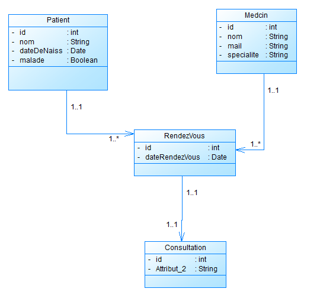

# Realisation
## Entities et repositories
### Entities
#### Patient
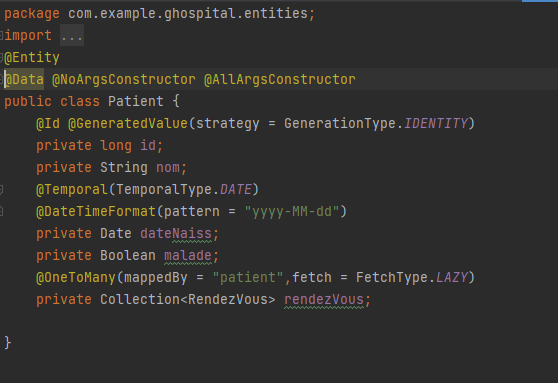

#### Medcin
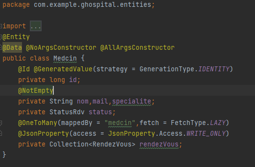

#### RendezVous
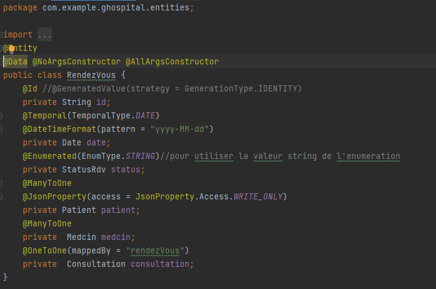

### Enumeration RendezVous
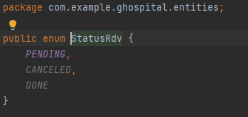

### Repositorie
#### Patient
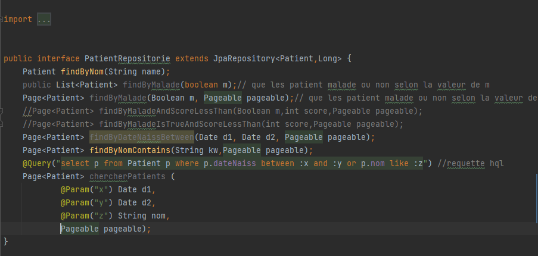

#### Medcin
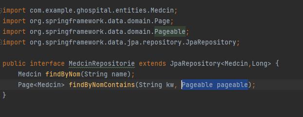

#### RendezVous
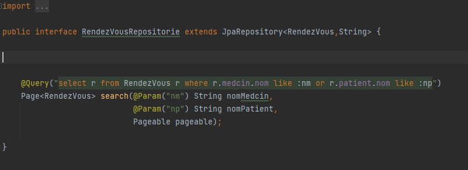

#### Consultation
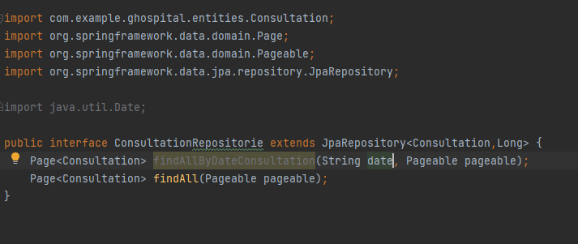

## Partie Web
### Controlleur
#### Patient
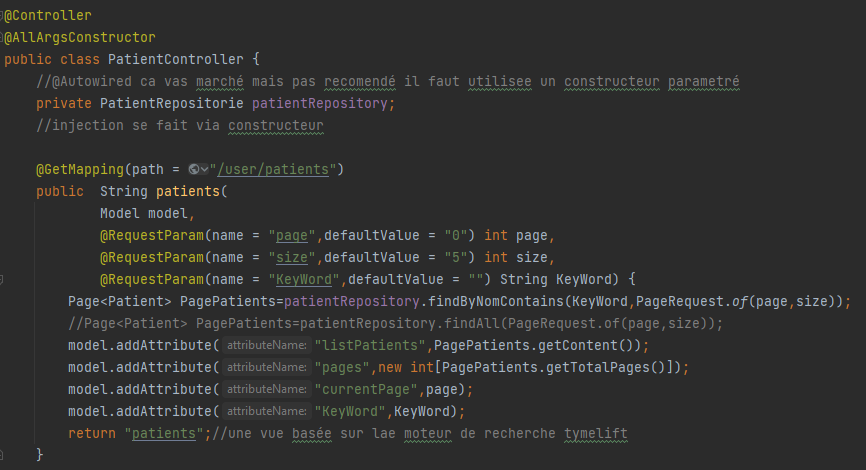
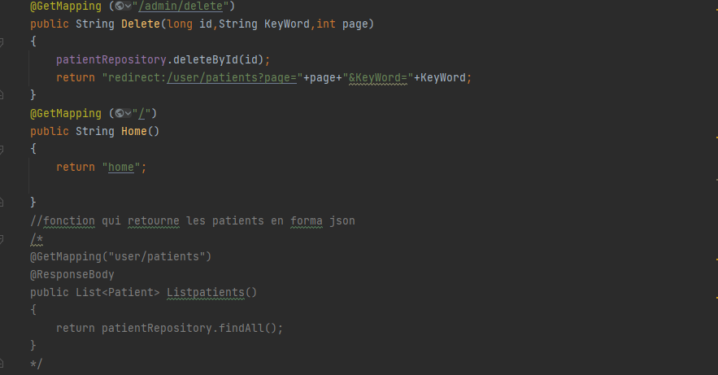
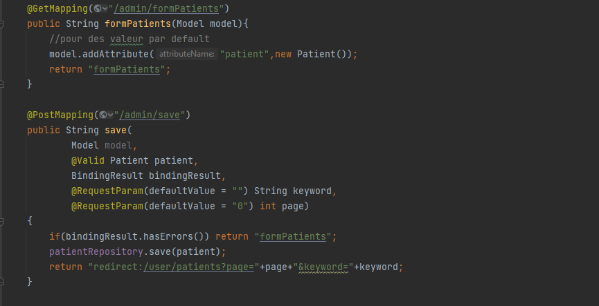
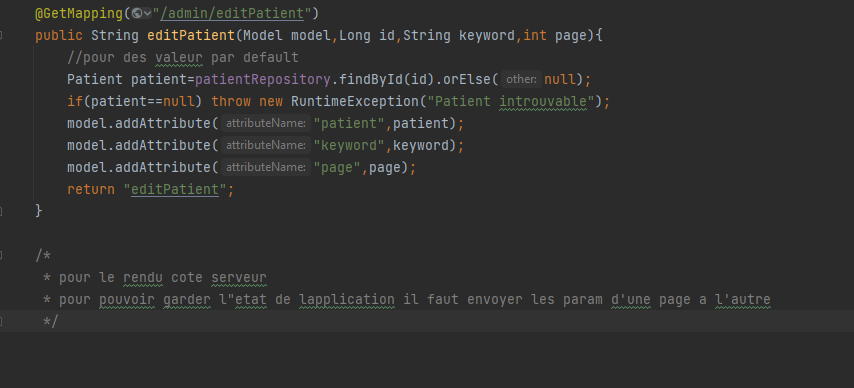

#### Medcin
la meme chose que patinet

#### RendezVous
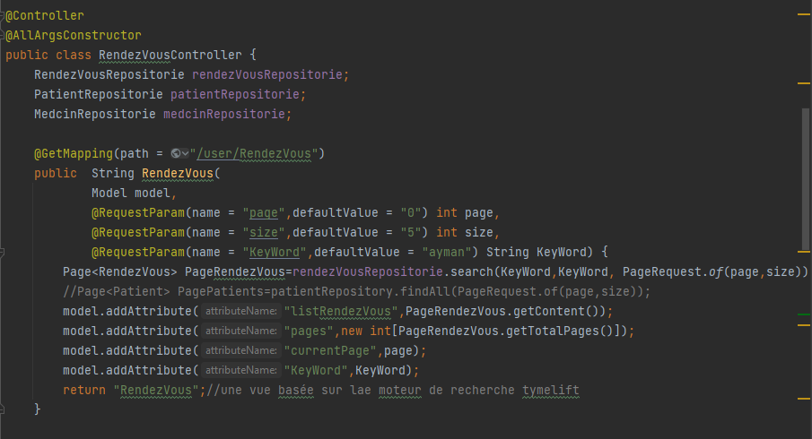
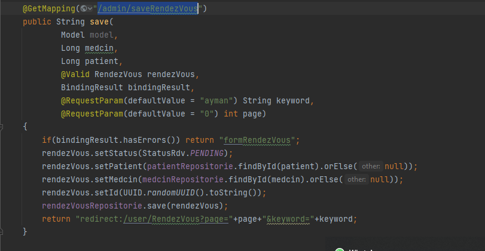

### page web
regarder le code source 'src/main/resources/templates'

## Partie Security
regarder le code source 'src/main/java/com/example/ghospital/securite'

dans la partie securty j'ai utilisé spring security(user details)
un framework Java/Java EE qui fournit l'authentification, l'autorisation et d'autres fonctions de sécurité pour les applications d'entreprise. Le projet a été lancé fin 2003 sous le nom de " Acegi Security " (prononcé Ah-see-gee /ɑːsiːdʒiː/, dont les lettres sont les premier, troisième, cinquième, septième et neuvième caractères de l'alphabet anglais, afin d'éviter les conflits de noms[2]) par Ben Alex, avec une diffusion publique sous la licence Apache en mars 2004. Par la suite, Acegi a été intégré au portefeuille de Spring sous le nom de Spring Security, un sous-projet officiel de Spring. La première version publique sous ce nouveau nom a été Spring Security 2.0.0 en avril 2008, avec un support commercial et des formations disponibles auprès de SpringSource.

### Securtity Config
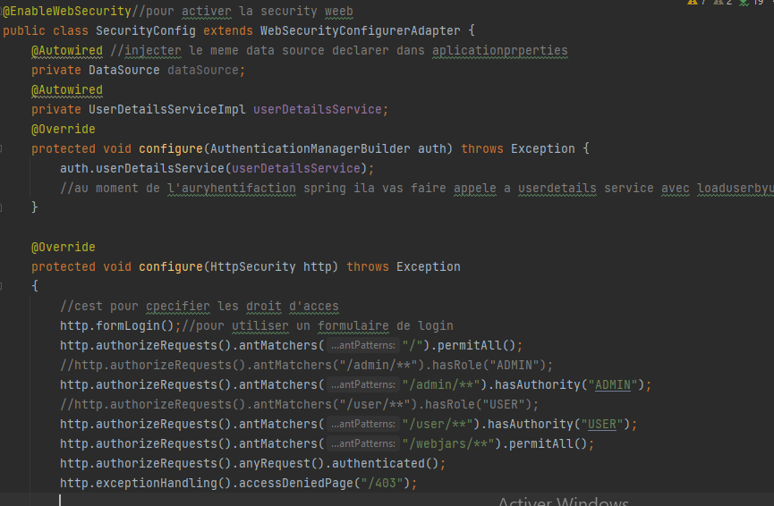

# Getting Started

### Reference Documentation

For further reference, please consider the following sections:

* [Official Apache Maven documentation](https://maven.apache.org/guides/index.html)
* [Spring Boot Maven Plugin Reference Guide](https://docs.spring.io/spring-boot/docs/2.6.7/maven-plugin/reference/html/)
* [Create an OCI image](https://docs.spring.io/spring-boot/docs/2.6.7/maven-plugin/reference/html/#build-image)
* [Spring Data JPA](https://docs.spring.io/spring-boot/docs/2.6.7/reference/htmlsingle/#boot-features-jpa-and-spring-data)
* [Spring Web](https://docs.spring.io/spring-boot/docs/2.6.7/reference/htmlsingle/#boot-features-developing-web-applications)
* [Thymeleaf](https://docs.spring.io/spring-boot/docs/2.6.7/reference/htmlsingle/#boot-features-spring-mvc-template-engines)

### Guides

The following guides illustrate how to use some features concretely:

* [Accessing Data with JPA](https://spring.io/guides/gs/accessing-data-jpa/)
* [Building a RESTful Web Service](https://spring.io/guides/gs/rest-service/)
* [Serving Web Content with Spring MVC](https://spring.io/guides/gs/serving-web-content/)
* [Building REST services with Spring](https://spring.io/guides/tutorials/bookmarks/)
* [Handling Form Submission](https://spring.io/guides/gs/handling-form-submission/)

